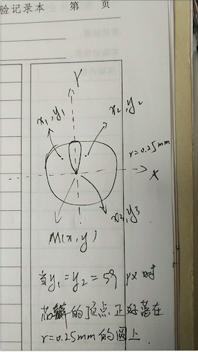

### 需求描述
用R代码画出paper里的图


出自Reganold, J. P., & Wachter, J. M. (2016). Organic agriculture in the twenty-first century. Nature Plants, 2(2), 15221.

### 使用场景
场景一：评估一个总体的不同组分的比例变化

场景二：评价同一衡量体系下的各项不同指标

### 输入数据
包含Name、ratio、fill、text_size、text_color的文件，用tab间隔

不用修改任何代码，直接准备好输入文件就ok了

输入文件的txt文本中，第一行即各列的名称，不能修改

```{r}
mydata <- read.table("data.txt", sep = "\t", header = T, stringsAsFactors = F, colClasses = c("character", "numeric", "character", "integer", "character"))
head(mydata)
```

### 开始画图
画布将设置为21cm * 29.7cm（宽高）的A4纸

1cm = 35.43307px

#### 准备svg语句

##### 1.画4个圆

svg圆语句格式为\<circle cx cy r style="stroke:#006600;fill:#00cc00"/\>，其中参数cx、cy定义原点坐标，r定义圆半径，style定义线颜色宽度类型填充等（其中，stroke定义线的颜色，stroke-width定义线的宽度，stroke-dasharray定义虚线，fill定义圆的填充颜色）


```{r}
#定义圆的原点，及最外圆的图形半径
rx<-10.5 * 35.43307
ry<-7.5 * 35.43307
rr<-5.00 * 35.43307
#将svg语句写入circos
circos <- data.frame(paste("<circle cx=\"", rx, "\" cy=\"", ry, "\" r=\"", .25 * rr, "\" style=\"stroke:#b7b7b7; stroke-width:1; stroke-dasharray: 10 5; fill:none\"/>", sep = ""),
                     paste("<circle cx=\"", rx, "\" cy=\"", ry, "\" r=\"", .50 * rr, "\" style=\"stroke:#6c6b6b; stroke-width:2; fill:none\"/>", sep = ""),
                     paste("<circle cx=\"", rx, "\" cy=\"", ry, "\" r=\"", .75 * rr, "\" style=\"stroke:#b7b7b7; stroke-width:1; stroke-dasharray: 10 5; fill:none\"/>", sep = ""),
                     paste("<circle cx=\"", rx, "\" cy=\"", ry, "\" r=\"", 1.00*rr, "\" style=\"stroke:#6c6b6b; stroke-width:2; fill:none\"/>", sep = "")
)
```

##### 2.通过路径（path）画花瓣
原理图


花瓣的语句格式为\<path d="Mx,y Cx1,y1 x2,y2 x3,y3" style="stroke: #006666; fill:none;"/\> ，其中的参数M表示“移动到”，M后的x,y表示路径起点坐标,C表示“三次贝塞尔曲线到”，C后的x1,y1 x2,y2 x3,y3分别表示贝塞尔曲线2个控制点和终点坐标


```{r}
#根据输入文件中确定每个花瓣旋转角度
angle_base <- 360/nrow(mydata)

for (i in 1: nrow(mydata)) {
  mydata[i, 6] <- angle_base * (i-1)
}
names(mydata)[6] <- "angle"

#贝塞尔曲线控制点坐标设置
cx1<-rx - 35/(nrow(mydata)/6) - 20 * mydata$ratio #35是经测试获得的花瓣不重叠时控制点坐标相对原点X轴最佳位移,35/(nrow(mydata)/6)即根据用户自定义的花瓣个数计算最佳位移,减去20 * mydata$ratio是为了根据ratio大小调整花瓣宽度

cy1<-ry - mydata$ratio * 59 / 0.25 #经测试,花瓣曲线控制点的y轴位移为59px时获得的花瓣的长度是0.25倍的最外圆半径
cx2<-rx + 35/(nrow(mydata)/6) + 20 * mydata$ratio
cy2<-cy1

#将花瓣语句写入mydata
mydata$bezier <- paste("<path d=\"M",rx,",",ry," C", cx1, ",", cy1, ",", cx2, ",", cy2, ",",rx,",",ry,"\" transform=\"rotate(", mydata$angle, " ",rx," ",ry,")\"", " fill=\"#", mydata$fill, "\" stroke = \"black\" stroke-width = \"0.5px\" />", sep = "")
```

##### 3.文本语句
svg文本格式为\<text x y font-size fill >words\</text\>，x，y是文本左下角的坐标


```{r}
#设置文本坐标
tx<-rx - nchar(mydata$Name) * 3#根据文字长度设置X轴位移
ty<-ry - rr - 6
#将文本语句写入mydata，rotate函数参数包括旋转角度及旋转中心点坐标
mydata$text <- paste("<text x=\"", tx, "\" y=\"", ty, "\" font-size=\"", mydata$text_size, "\" transform=\"rotate(", mydata$angle, " ",rx," ",ry,")\"", " fill=\"#", mydata$text_color, "\" >", mydata$Name, "</text>", sep = "")
```

#### 将准备好的svg语句写入.svg文件
首先写入XML声明、svg dtd、svg代码开始标签\</svg>
```{r}
first_line <- data.frame("<?xml version=\"1.0\" standalone=\"no\"?>",
                         "<!DOCTYPE svg PUBLIC \"-//W3C//DTD SVG 1.1//EN\"",
                         "\"http://www.w3.org/Graphics/SVG/1.1/DTD/svg11.dtd\">",
                         "",
                         paste("<svg id=\"svg\" width=\"744.0945\" height=\"1052.362\">", "\t")#画布设置为21cm * 29.7cm（宽高）的A4纸
)
write.table(first_line[1, 1], "radar.svg", col.names = FALSE, row.names = FALSE, quote = FALSE)
write.table(first_line[1, 2], "radar.svg", col.names = FALSE, row.names = FALSE, quote = FALSE, append = TRUE)
write.table(first_line[1, 3], "radar.svg", col.names = FALSE, row.names = FALSE, quote = FALSE, append = TRUE)
write.table(first_line[1, 4], "radar.svg", col.names = FALSE, row.names = FALSE, quote = FALSE, append = TRUE)
write.table(first_line[1, 5], "radar.svg", col.names = FALSE, row.names = FALSE, quote = FALSE, append = TRUE)
```

#### 写入准备好的画圆、花瓣、文本语句
```{r}
write.table(circos[1, 1], "radar.svg", col.names = FALSE, row.names = FALSE, quote = FALSE, append = TRUE)
write.table(circos[1, 2], "radar.svg", col.names = FALSE, row.names = FALSE, quote = FALSE, append = TRUE)
write.table(circos[1, 3], "radar.svg", col.names = FALSE, row.names = FALSE, quote = FALSE, append = TRUE)
write.table(circos[1, 4], "radar.svg", col.names = FALSE, row.names = FALSE, quote = FALSE, append = TRUE)
write.table(mydata$bezier, "radar.svg", col.names = FALSE, row.names = FALSE, quote = FALSE, append = TRUE)
write.table(mydata$text, "radar.svg", col.names = FALSE, row.names = FALSE, quote = FALSE, append = TRUE)

#最后一行写入svg代码结束标签</svg>
last_line <- data.frame(paste("</svg>"))
write.table(last_line[1, 1], "radar.svg", col.names = FALSE, row.names = FALSE, quote = FALSE, append = TRUE)
```

### 输出文件
*.svg文件，矢量图，可以用illustrator、Inkscape等工具打开


```{r}
sessionInfo()
```