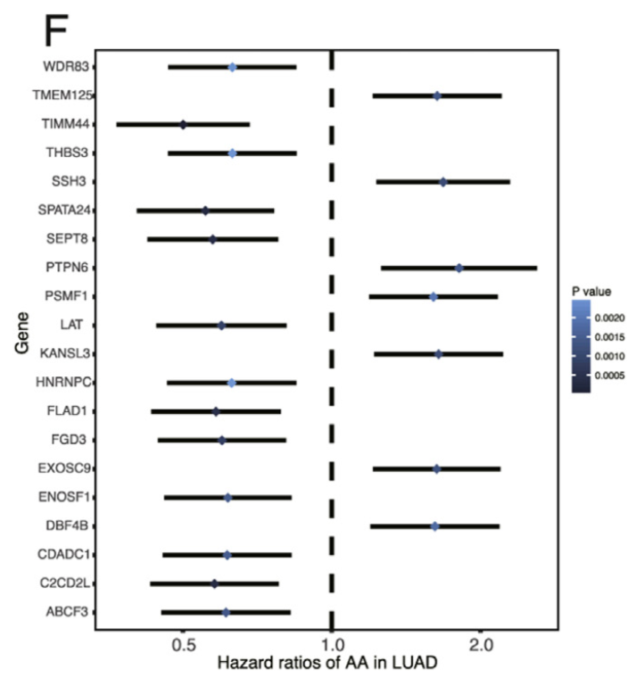

```{r setup, include=FALSE}
knitr::opts_chunk$set(echo = TRUE)
```

## 需求描述

单基因cox分析，并画出像paper里的图。

计算HR，保存到文件，作为FigureYa6森林图的输入。



出自<https://www.sciencedirect.com/science/article/pii/S0304383517301258?via%3Dihub>

## 应用场景

cox比例风险回归模型，由英国统计学家D.R.Cox于1972年提出

主要用于肿瘤和其他慢性疾病的预后分析，也可用于队列研究的病因探索

单因素cox分析主要探索单个基因的独立预后影响

cox分析可用于转录组，甲基化，miRNA, LncRNA, 可变剪切等等

## 环境设置

```{r, message=FALSE}
#options("repos"= c(CRAN="https://mirrors.tuna.tsinghua.edu.cn/CRAN/"))
#options(BioC_mirror="http://mirrors.ustc.edu.cn/bioc/")
# install.packages("ggstatsplot")
library(tidyverse)
library(ggplot2)
library(ggstatsplot)
library(survival)
library(stringr)
library(viridis)
library(scales)
```

## 输入文件的准备

如果你的数据已经整理成easy_input_4cox.csv的格式，就可以跳过这步，直接进入“单因素cox分析”。

如果你的数据已经整理成cox_output.csv的格式，就可以跳过这步，直接进入“开始画图”。

此处以LUAD为例，从TCGA下载生存资料和表达矩阵，处理为cox分析需要的的easy_input.csv。

### 第一步：样本资料整理，提取LUAD样本名

数据来源：

- TCGA_phenotype_denseDataOnlyDownload.tsv，TCGA样本资料，下载地址：<https://pancanatlas.xenahubs.net/download/TCGA_phenotype_denseDataOnlyDownload.tsv.gz>
- samplepair.txt，TCGA跟GTEx的组织对应关系，参照GEPIA help的Differential analysis：<http://gepia.cancer-pku.cn/help.html>，整理成samplepair.txt文件
- Survival_SupplementalTable_S1_20171025_xena_sp，cell处理优化过的生存资料，下载地址：<https://pancanatlas.xenahubs.net/download/Survival_SupplementalTable_S1_20171025_xena_sp.gz>

```{r}
# 建立疾病全称跟缩写的对应关系
samplepair <- read.delim("samplepair.txt",as.is = T)
tissue <- samplepair$TCGA
names(tissue) <- samplepair$Detail

# 提取LUAD的样本资料
tcgacase <- read.delim(file="TCGA_phenotype_denseDataOnlyDownload.tsv",header=T,as.is = T)  
tcgacase$tissue <- tissue[tcgacase$X_primary_disease]
tcgacase$type <- ifelse(tcgacase$sample_type=='Solid Tissue Normal',paste(tcgacase$tissue,"normal_TCGA",sep="_"),paste(tcgacase$tissue,"tumor_TCGA",sep="_"))
tcgacase$type2 <- ifelse(tcgacase$sample_type=='Solid Tissue Normal',"normal","tumor")
tcgatable<-tcgacase[,c(1,5:7)]
head(tcgatable)
lung <- filter(tcgatable, tissue == "LUAD",type2=="tumor")

# 找到LUAD病人的生存资料，并与RNA-Seq样本比对
surivival<- read.delim("Survival_SupplementalTable_S1_20171025_xena_sp",as.is = T)
colnames(surivival)
LUADsur <- filter(surivival,cancer.type.abbreviation== 'LUAD')
LUADsur <- LUADsur[,c(1,2,3,4,14,26,27)]
rownames(LUADsur) <- LUADsur$sample

#取交集
a <- intersect(LUADsur$sample,lung$sample)
luadsurvival_tumor <- LUADsur[a,] %>%
  filter(!is.na(OS.time))
surdata <- luadsurvival_tumor[,c(1,2,6,7)] #整理好的LUAD病人生存资料
surdata[1:5,1:4]
```

### 第二步：表达矩阵处理

这里直接读取LUAD基因的表达矩阵：easy_input_expr.csv

若要从pan-cancer提取处理好的某个癌症的RNA-seq数据，参考FigureYa55panCancer_violin或FigureYa56immune_inflitrationV2

```{r}
tcgadatatpm <- read.csv("easy_input_expr.csv",row.names = 1)
tcgadatatpm[1:5,1:5]
luadsample <- intersect(row.names(tcgadatatpm),luadsurvival_tumor$sample)  #找到有生存信息的样本
row.names(luadsurvival_tumor) <- luadsurvival_tumor$sample
luadsurvival_tumortime <- luadsurvival_tumor[luadsample,]
luadsurvival_tumortime <- luadsurvival_tumortime[,c(1,6,7)]
tcgadatatpm$sample <- row.names(tcgadatatpm)
```

### 第三步：整理为cox分析的输入格式

```{r}
realdata <- merge(luadsurvival_tumortime,tcgadatatpm,by="sample") 
row.names(realdata) <- realdata$sample
realdata <- realdata[,-1]
#realdata$OS.time <- realdata$OS.time/365 这一步day to year，变不变无所谓
realdata[1:5,1:5]
write.csv(realdata,"easy_input_4cox.csv")
```

## 单因素cox分析

```{r}
realdata <- read.csv("easy_input_4cox.csv", row.names = 1)
realdata[1:3,1:6]

Coxoutput=data.frame()
for(i in colnames(realdata[,3:ncol(realdata)])){
  cox <- coxph(Surv(OS.time, OS) ~ realdata[,i], data = realdata)
  coxSummary = summary(cox)
  Coxoutput=rbind(Coxoutput,cbind(gene=i,HR=coxSummary$coefficients[,"exp(coef)"],
                            z=coxSummary$coefficients[,"z"],
                            pvalue=coxSummary$coefficients[,"Pr(>|z|)"],
                            lower=coxSummary$conf.int[,3],
                            upper=coxSummary$conf.int[,4]))
}
for(i in c(2:6)){
  Coxoutput[,i] <- as.numeric(as.vector(Coxoutput[,i]))
}
Coxoutput <- arrange(Coxoutput,pvalue)  %>% #按照p值排序
  filter(pvalue < 0.05) 

#保存到文件
write.csv(Coxoutput,'cox_output.csv', row.names = F)
```

此结果可与FigureYa6森林图衔接，画出不同形式的森林图

只需把FigureYa6输入文件的Point Estimate改为HR，Low改为lower，High改为upper，其余自行添加

## 开始画图

```{r}
Coxoutput <- read.csv("cox_output.csv")
head(Coxoutput)

plotCoxoutput <- filter(Coxoutput,HR <=0.92 | HR>= 1.15)  #选择合适的top genes

#采用那篇nature的配色
ggplot(data=plotCoxoutput,aes(x=HR,y=gene,color=pvalue))+
  geom_errorbarh(aes(xmax=upper,xmin=lower),color="black",height=0,size=1.2)+
  geom_point(aes(x=HR,y=gene),size=3.5,shape=18)+ #画成菱形
  geom_vline(xintercept = 1,linetype='dashed',size=1.2)+
  scale_x_continuous(breaks = c(0.75,1,1.30))+
  coord_trans(x='log2')+ 
  ylab("Gene")+  #标签
  xlab("Hazard ratios of AA in LUAD")+ 
  labs(color="P value",title ="Univariate Cox regression analysis" )+
  scale_color_viridis()+  #nature配色
  theme_ggstatsplot()+  #好看的主题，同原文一致
  theme(panel.grid =element_blank()) #去除网格线
ggsave('plot1.pdf',width = 8,height = 9)

#让误差线跟着变色
ggplot(data=plotCoxoutput,aes(x=HR,y=gene,color=pvalue))+
  geom_errorbarh(aes(xmax=upper,xmin=lower,color = pvalue),height=0,size=1.2)+
  geom_point(aes(x=HR,y=gene),size=3.5,shape=18)+   #画成菱形
  geom_vline(xintercept = 1,linetype='dashed',size=1.2)+
  scale_x_continuous(breaks = c(0.75,1,1.30))+
  coord_trans(x='log2')+ 
  ylab("Gene")+  #标签
  xlab("Hazard ratios of AA in LUAD")+ 
  labs(color="P value",title ="" )+
  scale_color_viridis()+ 
  theme_ggstatsplot()+  #好看的主题，同原文一致
  theme(panel.grid =element_blank()) #去除网格线
ggsave('plot2.pdf',width = 8,height = 9)

#自己DIY主题和颜色
ggplot(data=plotCoxoutput,aes(x=HR,y=gene,color=pvalue))+
  geom_errorbarh(aes(xmax=upper,xmin=lower),color='black',height=0,size=1.2)+
  geom_point(aes(x=HR,y=gene),size=3.5,shape=18)+   #画成菱形
  geom_vline(xintercept = 1,linetype='dashed',size=1.2)+
  scale_x_continuous(breaks = c(0.75,1,1.30))+
  coord_trans(x='log2')+ 
  ylab("Gene")+  #标签
  xlab("Hazard ratios of AA in LUAD")+ 
  labs(color="P value",title ="" )+
  scale_color_gradient2(low = muted("skyblue"),mid ="white",high =muted('pink'),midpoint = 0.025)+ #樱花色
  theme_bw(base_size = 12)+   #字体大小，格式
  theme(panel.grid =element_blank(),  #去除网格线，开始DIY主题
        axis.text.x = element_text(face="bold", color="black", size=9),    #各个字体大小
        axis.text.y = element_text(face="bold",  color="black", size=9),
        axis.title.x = element_text(face="bold", color="black", size=11),
        axis.title.y = element_text(face="bold",color="black", size=11),
        legend.text= element_text(face="bold", color="black", size=9),
        legend.title = element_text(face="bold", color="black", size=11),
        panel.border = element_rect(colour = 'black',size=1.4))   #边框粗细
ggsave('plot3.pdf',width = 8,height = 9)
```

## 例文的原图复现

下载原文数据（Suptable2)，根据原文原始数据完全重复原文图片

原文有LUAD和LUSC，这里选择LUAD

```{r}
df <- read.csv("suptable2LUAD.csv",sep='\t')

#这里选择AA进行画图,原文展示的是top20genes
AAtop20 <- filter(df,splice_type=='AA') #提取AA
AAtop20 <- AAtop20[1:20,]

#画图
ggplot(data=AAtop20,aes(x=HR,y=symbol,color=pvalue))+
  geom_errorbarh(aes(xmax=upper,xmin=lower),color="black",height=0,size=1.2)+
  geom_point(aes(x=HR,y=symbol),size=3.5,shape=18)+   #画成菱形
  geom_vline(xintercept = 1,linetype='dashed',size=1.2)+
  scale_x_continuous(breaks = c(0.5,1,2))+
  coord_trans(x='log2')+  #让x轴0.5到1，1到2距离一样，两边对称，好看！
  ylab("Gene")+  #标签
  xlab("Hazard ratios of AA in LUAD")+ 
  labs(color="P value",title ="" )+
  theme_ggstatsplot()+  #好看的主题，同原文一致
  theme(panel.grid =element_blank()) #去除网格线
ggsave('sameplot2.pdf',width = 8,height = 9)
```

```{r}
sessionInfo()
```