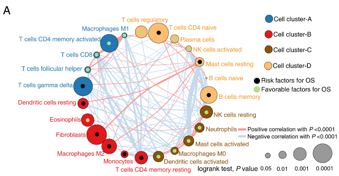

```{r setup, include=FALSE}
knitr::opts_chunk$set(echo = TRUE)
```

## 需求描述

复现原文免疫细胞之间相关性的网络图



出自<http://cancerimmunolres.aacrjournals.org/content/early/2019/03/06/2326-6066.CIR-18-0436>

节点的颜色代表细胞所属的cluster，节点的大小代表生存分析的log_rank_p，用圆心点的颜色展示HR，连线颜色代表正/负相关，连线的粗细代表相关性Pvalue。

## 应用场景

用网络图同时展示相关关系、pvalue、聚类/分类结果、跟预后的关系。

- 例如例文中各细胞之间的相关关系、跟预后的关系
- 或表达谱数据中多个基因的相关性、聚类结果、pvalue、跟预后的关系

**画法说明：**

- 用代码画出例图中除圆心以外的部分。
- 再根据“output_HR_corlor.csv”的最后一列，用Illustrator在圆心上画点，点的颜色代表HR的正负。
- 最后输出的pdf文件是矢量图，可以用Illustrator等软件调整细胞名等文字的位置。

## 环境设置

```{r}
library(reshape2)
library(corrplot)
library(plyr)
library(igraph) #用于绘制网络图

Sys.setenv(LANGUAGE = "en") #显示英文报错信息
options(stringsAsFactors = FALSE) #禁止chr转成factor
```

## 参数设置

```{r}
poscol <- "#FB9A99" #正相关用红色连线
negcol <- "#C6DBEF" #负相关用蓝色连线

mycol <- c("#FDBF6F", "#1F78B4", "#E31A1C", "#8C510A") #cluster的颜色，如果有更多类，就给更多的颜色
```

## 输入文件

至少要提供easy_input_immune.csv文件，例如免疫细胞矩阵，或基因表达矩阵（把这里的免疫细胞替换成基因即可）。如果没有生存分析结果，可以用其他pvalue代替。

easy_input_immune.csv，免疫细胞矩阵文件，用于计算相关系数和P值、把细胞分成4个cluster、通过卡相关性的P值来建立细胞间的连接关系。每行一个sample，每列一种细胞。最后一列fibioblast用mcpcounter获得，可参考FigureYa56immune_inflitration；文中其他22种免疫细胞用CIBERSORT计算获得，还可以用FigureYa56immune_inflitration或FigureYa71ssGSEA来量化免疫细胞。

easy_input_HR.csv，生存分析结果，需要HR（节点圆心点的颜色，用AI来加）和p value（节点圆的大小）列。可通过FigureYa47HR2table计算获得。

```{r}
# 免疫细胞矩阵
input_data <- read.csv("easy_input_immune.csv", row.names = 1, check.names = F)
dim(input_data)
input_data[1:3,1:3]

# 生存分析结果
bb <- read.csv("easy_input_HR.csv",header = T);
head(bb)
bb$Cell.types <- as.character(bb$Cell.types) 
colnames(bb)[1] <- c("ID")
#用pvalue控制节点圆的大小
bb$weight <- abs(log10(bb$log_rank_p))
#用HR标圆心点的颜色
bb$weight_HR <- (as.numeric(bb$HR)-1)*100
bb$colr <- ifelse(bb$weight_HR<0, "green", "black")
head(bb)

#保存到文件，根据最后一列颜色在最后输出的pdf文件中画圆心
write.csv(bb, "output_HR_corlor.csv", quote = F)
```

## 相关性的计算

### 计算每两种细胞间的相关性

计算每两种细胞间的相关性corr，用corrplot可视化，看看聚成几类比较好。

```{r, fig.width = 8, fig.height = 8}
# options(scipen = 100,digits = 4)
corr <- cor(input_data, method = "spearman")
corrplot(corr,title = "", 
         method = "pie", #或"circle" (default), "square", "ellipse", "number", "pie", "shade" and "color"
         outline = T, addgrid.col = "darkgray", 
         order="hclust", addrect = 4, #hclust聚为4类，根据数据的具体情况调整
         mar = c(4,0,4,0), #撑大画布，让细胞名显示完全
         rect.col = "black", rect.lwd = 5, cl.pos = "b", 
         tl.col = "black", tl.cex = 1.08, cl.cex = 1.5, tl.srt=60)
```

### 计算相关性分析的P值

也可以用Hmsic包来求，但是发现它输出的P值有限制。

```{r, warning=FALSE}
cor.mtest <- function(corr, ...) {
  corr <- as.matrix(corr)
  n <- ncol(corr)
  p.corr <- matrix(NA, n, n)
  diag(p.corr) <- 0
  for (i in 1:(n - 1)) {
    for (j in (i + 1):n) {
      tmp <- cor.test(corr[, i],method = "spearman", corr[, j], ...)
      p.corr[i, j] <- p.corr[j, i] <- tmp$p.value
    }
  }
  colnames(p.corr) <- rownames(p.corr) <- colnames(corr)
  p.corr
}

p.corr <- cor.mtest(input_data) 
head(p.corr[, 1:5])
```

### 计算节点间的连接关系

只保留那些相关性较强的连接

```{r}
#合并相关系数和P值
rr <- as.data.frame(corr);
rr$ID <- rownames(rr)
cor <- melt(rr,"ID",value.name = "cor"); #head(cor)

pp <- as.data.frame(p.corr);
pp$ID <- rownames(pp)
pvalue <- melt(pp,"ID",value.name = "pvalue"); #head(pvalue)
colnames(pvalue) <- c("from","to","pvalue")

corpvlue <- cbind(pvalue, cor)
head(corpvlue)
corpvlue <- corpvlue[, -c(4:5)]
head(corpvlue)
dim(corpvlue)

#去掉相关性较弱的连接
corpvlue <- corpvlue[corpvlue$pvalue < 0.0001,] #只保留pvalue < 0.0001的
dim(corpvlue)
corpvlue$weight <- corpvlue$pvalue
corpvlue$weight <- -log10(corpvlue$weight)
head(corpvlue)

#去掉相关系数为1，也就是两个相同变量之间的连接
corpvlue <- corpvlue[!corpvlue$cor==1,]
dim(corpvlue)
#去掉相关系数一样的连接--也就是重复计算的连接
summary(duplicated(corpvlue$weight))
corpvlue <- corpvlue[!duplicated(corpvlue$weight),]
dim(corpvlue)

#相关系数的正负用不同颜色表示
corpvlue$color <- ifelse(corpvlue$cor<0, negcol, poscol)

#保存到文件，便于查看
write.csv(corpvlue, "output_links.csv")
```

## 利用矩阵文件进行细胞的聚类

细胞聚类的结果综合考虑了"hclust"的结果、"kmeans"聚类的结果、以及目前的研究现状

```{r}
cellcluster <- as.data.frame(t(input_data))
#cellcluster[1:5,1:5]

hc <- hclust(dist((cellcluster)))
hcd <- as.dendrogram(hc)
(clus4 <- cutree(hc, 4)) #分4类

A <- as.character(rownames(as.data.frame(subset(clus4,clus4==1))))
B <- as.character(rownames(as.data.frame(subset(clus4,clus4==2))))
C <- as.character(rownames(as.data.frame(subset(clus4,clus4==3))))
D <- as.character(rownames(as.data.frame(subset(clus4,clus4==4))))
cls <- list(A,B,C,D)

nodes <- as.data.frame(unlist(cls))
nodes$type <- c(rep("B",9),rep("A",4),rep("C",5),rep("D",5))
names(nodes) <- c("media","type.label")

#以hclust的结果为基础，调整部分细胞所属的cluster
nodes$type.label[nodes$media=="T cells follicular helper"] <- "B"
nodes$type.label[nodes$media=="B cells naive"] <- "A"
nodes$type.label[nodes$media=="T cells CD4 naive"] <- "A"
nodes$type.label[nodes$media=="Plasma cells"] <- "A"
nodes$type.label[nodes$media=="Dendritic cells resting"] <- "C"
nodes$type.label[nodes$media=="Eosinophils"] <- "C"
nodes$type.label[nodes$media=="Mast cells resting"] <- "A"

nodes <- as.data.frame(nodes)
nodes$media <- as.character(nodes$media)
nodes
```

## 构建网络的input文件

```{r}
# 合并生存分析的数据和细胞分类的数据
summary(nodes$media %in% bb$ID) #检查细胞名是否一致
nodes <- merge(nodes, bb, by.x = "media", "ID", all.x = T, all.y = T) #按细胞名merge

nodes$Fraction <- abs(nodes$weight_HR)
nodes$id <- paste("S", 01:23, sep = "")
nodes <- nodes[order(nodes$type.label),]
nodes <- nodes[,c(ncol(nodes),1:ncol(nodes)-1)]
nodes <- nodes[order(nodes$type.label),]
nodes

#建立nodes和links的连接id，把细胞名换成ID
paste0("'",nodes$media,"'","=","'",nodes$id,"'",collapse = ",")
corpvlue$from <- revalue(corpvlue$from,c('B cells memory'='S1','B cells naive'='S2','Dendritic cells activated'='S3',
                                       'Dendritic cells resting'='S4','Eosinophils'='S5','Fibroblasts'='S6','Macrophages M0'='S7',
                                       'Macrophages M1'='S8','Macrophages M2'='S9','Mast cells activated'='S10',
                                       'Mast cells resting'='S11','Monocytes'='S12','Neutrophils'='S13',
                                       'NK cells activated'='S14','NK cells resting'='S15','Plasma cells'='S16',
                                       'T cells CD4 memory activated'='S17','T cells CD4 memory resting'='S18',
                                       'T cells CD4 naive'='S19','T cells CD8'='S20','T cells follicular helper'='S21',
                                       'T cells gamma delta'='S22','T cells regulatory Tregs'='S23'))
corpvlue$to <- revalue(corpvlue$to,c('B cells memory'='S1','B cells naive'='S2','Dendritic cells activated'='S3',
                                   'Dendritic cells resting'='S4','Eosinophils'='S5','Fibroblasts'='S6','Macrophages M0'='S7',
                                   'Macrophages M1'='S8','Macrophages M2'='S9','Mast cells activated'='S10',
                                   'Mast cells resting'='S11','Monocytes'='S12','Neutrophils'='S13',
                                   'NK cells activated'='S14','NK cells resting'='S15','Plasma cells'='S16',
                                   'T cells CD4 memory activated'='S17','T cells CD4 memory resting'='S18',
                                   'T cells CD4 naive'='S19','T cells CD8'='S20','T cells follicular helper'='S21',
                                   'T cells gamma delta'='S22','T cells regulatory Tregs'='S23'))
(links <- corpvlue)

#利用nodes和links构建网络的input文件
net <- graph_from_data_frame(d=links, vertices=nodes, directed=T) 
```

### 开始画图

```{r, fig.width=10, fig.height=8}
# Generate colors based on cell clusters:
V(net)$color <- revalue(nodes$type.label,c("A"=mycol[1],"B"=mycol[2],"C"=mycol[3],"D"=mycol[4]))
# Compute node degrees (#links) and use that to set node size:
# Set edge width based on weight-log10(p_value):
V(net)$size <- (1 + V(net)$weight)*3 #节点圆的大小，可根据自己的数据再做调整
V(net)$label <- V(net)$media #设置标签
E(net)$arrow.mode <- 0 #不需要箭头
E(net)$edge.color <- "tomato" # tomato gray80
E(net)$width <- 1+E(net)$weight/6  #连接之间权重

pdf("Immune_network.pdf", width = 9.75, height = 8.78 )
plot(net,
     layout=layout_in_circle, #按圆圈布局
     edge.curved=.2, #画弯曲的连线
     vertex.label.color=V(net)$color, #细胞名的颜色
     vertex.label.dist= -2, #标签和节点的位置错开，后期还是要用AI调整
     edge.color=links$color)

#cluster的图例
legend("topright", #图例的位置
       c("Cell cluster-A", "Cell cluster-B", "Cell cluster-C", "Cell cluster-D"),
       pch=21, col="black", pt.bg=mycol, pt.cex=3,
       cex=1.3, bty="n", ncol=1)

#节点圆大小的图例，参考了FigureYa75base_volcano
f <- c(0.05, 0.001, 0.00001, 0.00000001)
s <- sqrt(abs(log10(f)))*3
legend("bottomright", 
       inset=c(0,-.1), #向下移
       legend=f, text.width = .2, 
       title = "logrank test, P value", title.adj = -.5,
       pch=21, pt.cex=s, bty='n',
       horiz = TRUE, #横向排列
       col = "black")

#连线的图例
legend("bottomright",
       c("Positive correlation with P < 0.0001", 
         "Negative correlation with P < 0.0001"),
       col = c(poscol, negcol), bty="n", 
       cex = 1, lty = 1, lwd = 5)

dev.off()
```


文字的位置用Illustrator调整；再根据“output_HR_corlor.csv”的最后一列用Illustrator在圆心上画点，点的颜色代表HR的正负。

```{r}
sessionInfo()
```