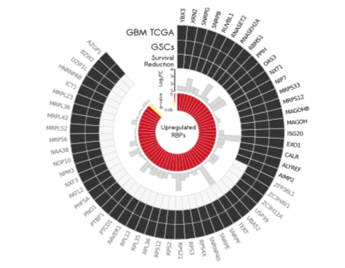

```{r setup, include=FALSE}
knitr::opts_chunk$set(echo = TRUE)
```

## 需求描述

用R画出paper里的这种圆圈图。



出自<https://genomebiology.biomedcentral.com/articles/10.1186/s13059-016-0990-4>

Fig. 2 Candidates’ selection and characterization. a. Circos plot shows **58 upregulated RNA-binding proteins (RBPs)** in glioblastoma (GBM) samples from The Cancer Genome Atlas (TCGA) and glioma stem cell (GSC) lines. **Fold-changes and corrected p-values** were extracted from the RNA-Seq analysis (GBM TCGA). Twenty-one RBPs were also associated with survival reduction and were further investigated.

## 应用场景

圆圈图上用热图、柱形图、热图展示多组数据、pvalue和log2FC，可灵活换成其他特征值。

## 环境设置

使用国内镜像安装包

```r
options("repos"= c(CRAN="https://mirrors.tuna.tsinghua.edu.cn/CRAN/"))
options(BioC_mirror="http://mirrors.ustc.edu.cn/bioc/")
install.packages("readxl", dependencies = TRUE)
install.packages("xlsx", dependencies = TRUE)
```

加载包

```{r}
library(readxl)
library(magrittr)
library(dplyr)
library(tibble)
library(ggplot2)

Sys.setenv(LANGUAGE = "en") #显示英文报错信息
options(stringsAsFactors = FALSE) #禁止chr转成factor
```

## 输入数据的整理

如果你的数据已经整理成easy_input.csv的格式，就可以跳过这步，直接进入“开始画图”。

从文献中看，需要读取`TableS2.TCGA_GBM_DiffExpRBPs`和`TableS3.GSCs_DiffExpRBPs`两个sheet。

另外，图中基因是按照Survival Reduction排列的，根据图反推survival Reduction，保存在survival.csv文件里。

```{r}
## 读取第2个工作表
sheet1 <- read_excel(path = "13059_2016_990_MOESM1_ESM.xls", sheet = 2, range = cell_cols("B:D"), col_names = TRUE, guess_max = 5) 

## 读取第3个工作表
sheet2 <- read_excel(path = "13059_2016_990_MOESM1_ESM.xls", sheet = 3, range = cell_cols("B:E"), col_names = TRUE, guess_max = 5) %>% .[,-2]

# 首先重命名变量，原来的变量名太长了
colnames(sheet1) <- c("Gene", "log2FC", "P_value")
colnames(sheet2) <- c("Gene", "log2FC", "P_value")

# Circos plot shows 58 upregulated RNA-binding proteins (RBPs) in glioblastoma (GBM) samples from The Cancer Genome Atlas (TCGA) and glioma stem cell (GSC) lines. 
# 根据文献中的要求，首先筛选log2FC大于0的基因
sheet1 %<>% filter(log2FC >= 0)
sheet2 %<>% filter(log2FC >= 0) %>% select(Gene) 

# Fold-changes and corrected p-values were extracted from the RNA-Seq analysis (GBM TCGA)
# 根据Gene取交集，保留GBM的Fold-changes和corrected p-values
sheet_bind <- inner_join(sheet1, sheet2, by = "Gene") %>% 
  distinct(Gene, .keep_all = TRUE)  #去重
sheet_bind$GBM <- rep(1, nrow(sheet_bind))
sheet_bind$GSC <- rep(1, nrow(sheet_bind))

# 跟Survival Reduction合并
surInfo <- read.csv("survival.csv")
head(surInfo)
#先按基因名降序排列基因名
surInfo <- arrange(surInfo, desc(Gene))
#合并后按survival降序排列
data_bind <- left_join(surInfo, sheet_bind, by = "Gene") %>% arrange(desc(survival)) 
head(data_bind)

write.csv(data_bind, "easy_input.csv", quote = F, row.names = F)
```

## 输入文件

至少包含基因、log2FC、P_value，给出一列或多列的01用于画最外面的圈。

此处把GBM、GSC、survival画到最外面的三个圈上，有就是1（最后显示为黑色），无就是0（最后显示为浅灰色）。

用柱形图展示log2FC，用热图展示P value。

```{r}
data_bind <- read.csv("easy_input.csv", colClasses=c('character','numeric','numeric','numeric','numeric','numeric'))
head(data_bind)
```

## 开始画图

### 首先画外面的3个环  

环形文字的写法：<https://www.r-graph-gallery.com/296-add-labels-to-circular-barplot/>

```{r}
#三个环的坐标稍高于log2FC的最大值即可
h <- max(data_bind$log2FC) + 0.2
tile_coord <- data.frame(Gene = data_bind$Gene, 
                         x = 1:nrow(data_bind), # x是中间x坐标
                         y1 = h, y2 = h + 2, y3 = h + 4, # 最外围三个圈的y坐标
                         stringsAsFactors = FALSE)

Angle_space <- 8 # 设置角度空隙大小
Angle_just <- 90 # 角度偏移量

# 增加角度变量
## 单位角度
unit_angle <- 360 / (nrow(tile_coord) + Angle_space + 0.5) 
text_angle <- Angle_just - cumsum(rep(unit_angle, nrow(tile_coord)))
tile_coord$hjust <- ifelse(text_angle < -90, 1, 0)
tile_coord$text_angle <- ifelse(text_angle < -90, text_angle + 180, text_angle)

data_result <- left_join(data_bind, tile_coord, by = "Gene")
head(data_result)

p1 <- ggplot(data_result) + 
  #第一圈，survival
  geom_tile(data = filter(data_result, survival == 1),
            aes(x = x, y = y1, width = 1, height = 2), 
            fill = "grey20", color = "lightgrey", size = .3) + 
  geom_tile(data = filter(data_result, survival == 0),
            aes(x = x, y = y1, width = 1, height = 2),
            fill = "grey96", color = "lightgrey", size = .3) + 
  
  #第二圈，GSC
  geom_tile(data = filter(data_result, GSC == 1),
            aes(x = x, y = y2, width = 1, height = 2), 
            fill = "grey20", color = "lightgrey", size = .3) + 
  #如果有0值，就去掉下面三行前面的#
  #geom_tile(data = filter(data_result, GSC == 0),
  #          aes(x = x, y = y2, width = 1, height = 2),
  #          fill = "grey96", color = "lightgrey", size = .3) + 
  
  #第三圈，GBM
  geom_tile(data = filter(data_result, GBM == 1),
            aes(x = x, y = y3, width = 1, height = 2), 
            fill = "grey20", color = "lightgrey", size = .3) + 
  #如果有0值，就去掉下面三行前面的#
  #geom_tile(data = filter(data_result, GBM == 0),
  #          aes(x = x, y = y3, width = 1, height = 2),
  #          fill = "grey96", color = "lightgrey", size = .3) + 
  #如果需要画更多圈，就继续往下写
  
  #写基因名，survival为1的基因名为黑色，否则为浅灰色
  geom_text(data = filter(data_result, survival == 1),
            aes(x = x, y = y3 + 1.6, label = Gene,
                angle = text_angle, hjust = hjust), color = "black", size = 2) + 
  geom_text(data = filter(data_result, survival == 0),
            aes(x = x, y = y3 + 1.6, label = Gene,
                angle = text_angle, hjust = hjust), color = "grey43", size = 2) + 
  
  coord_polar(theta = "x", start = 0, direction = 1) + 
  ylim(-5,13) + 
  xlim(0, nrow(data_bind) + Angle_space) +
  theme_void() 
p1
```

### 画`log2FC`

log2FC的y坐标从1开始，因此画图时要“y = log2FC - 1”

```{r}
p2 <- p1 + geom_col(aes(x = x, y = log2FC - 1), fill = "grey85", color = "grey80")
p2
```


### 添加log2FC的坐标轴及刻度文字

```{r}
p3 <- p2 + geom_segment(x = 0, y = 0, xend = 0, yend = 3, color = "black", size = .3) + 
  geom_text(x = -.5, y = 0, label = "1_", vjust = -.3, size = 1, color = "black") + 
  geom_text(x = -.5, y = 1, label = "2_", vjust = -.3, size = 1, color = "black") +
  geom_text(x = -.5, y = 2, label = "3_", vjust = -.3, size = 1, color = "black") +
  geom_text(x = -.5, y = 3, label = "4_", vjust = -.3, size = 1, color = "black")
p3
```

### 画`P_value`热图

```{r}
p4 <- p3 + geom_tile(aes(x = x, y = -1.2, width = 1, height = 2, fill = P_value), 
            color = "white") + 
  scale_fill_gradient(low = "firebrick3", high = "yellow") 
p4
```


### 插入文本

```{r}
p5 <- p4 + geom_text(x = -2.1, y = h + 4.5, label = "GBM TCGA", size = 3, color = "black") + 
  geom_text(x = -1.1, y = h + 2.5, label = "GSCs", size = 3, color = "black") + 
  geom_text(x = -1.8, y = h + .5, label = "Survival\nReduction", size = 2.5, color = "black") + 
  geom_text(x = -2.1, y = h - 2.4, label = expression('Log'[2]*'FC'), 
            angle = 90, size = 2.2, color = "black") + 
  geom_text(x = -3.3, y = h - 5, label = "p-value", 
            angle = 90, size = 1.5, color = "black") + 
  geom_text(x = 0, y = -5, label = "Upregulated\nRBPs", size = 2.5, color = "black")
p5
```

### 画P value的图例 

将图例调整到panel内部，并且调节文本的相对大小和相对位置。   

```{r}
p6 <- p5 +
  geom_text(x = -.5, y = -0.2, label = 0, size = 1, color = "black") + 
  geom_text(x = -1.8, y = -2, label = 0.05, size = 1, color = "black") + 
  guides(fill = guide_colorbar(title = "", reverse = TRUE, label = FALSE, 
                               barwidth = 0.1, barheight = 1.1)) + 
  theme(legend.position = c(0.5, 0.585), #图例的位置
        legend.title = element_blank())
p6
ggsave("图.pdf")
```

## 后期加工

前面的代码通过x和y的值一点一点调整好文字和图例的位置。

更容易的做法是：用矢量图编辑软件打开pdf文件，用鼠标调整。

```{r}
sessionInfo()
```