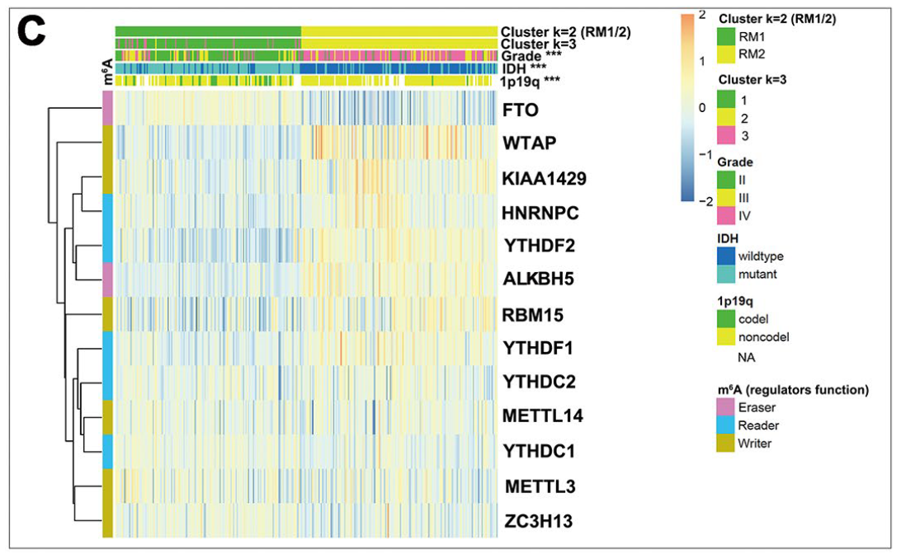

## 需求描述

1. 把cluster画到heatmap的顶部，相当于用颜色代替分类的树形结构。

2. 导出聚类后的样本顺序。

3. 让热图中的样本按照文件中的顺序排序。



出自<https://www.aging-us.com/article/101829/text>

## 应用场景

1. 为基因表达量、量化的免疫浸润等指标做聚类，突出展示分成2类、3类（也可以更多类）的效果。

2. 导出聚类后的样本顺序，用于后续分析，例如在cluster之间做生存分析。

3. 让热图中的样本按照文件中的顺序排序，例如让样本按照亚型、表型排序。

## 环境设置

使用国内镜像安装包

```r
options("repos"= c(CRAN="https://mirrors.tuna.tsinghua.edu.cn/CRAN/"))
options(BioC_mirror="http://mirrors.ustc.edu.cn/bioc/")
install.packages("ClassDiscovery")
```

加载包

```{r}
library(ClassDiscovery) #用于外部聚类
library(pheatmap) #用于绘制热图
library(gplots) #用于丰富热图颜色

Sys.setenv(LANGUAGE = "en") #显示英文报错信息
options(stringsAsFactors = FALSE) #禁止chr转成factor
```

## 输入文件

```{r}
mat <- read.csv("easy_input_expr.csv",row.names = 1,check.names = F,stringsAsFactors = F)
mat[1:3,1:3]
annCol <- read.csv("easy_input_annotation.csv",row.names = 1,check.names = F,stringsAsFactors = F)
head(annCol)

# 填补缺失值
annCol[is.na(annCol) | annCol == ""] <- "N/A"
```

## 开始画图

配置注释的颜色列表

```{r}
# 为easy_input_annotation.csv的每一列配色，最后会出现在热图上方
annColors <- list()
annColors[["gender"]] <- c("MALE"="blue","FEMALE"="red","N/A"="white")
annColors[["vital_status"]] <- c("Alive"="yellow","Dead"="black","N/A"="white")
annColors[["colon_polyps_present"]] <- c("YES"="red","NO"="black","N/A"="white")
annColors
```

这里列举几种情况，根据你想要的效果自行选择，也可以都画出来，对比效果。

### 1. pheatmap自带聚类生成热图

直接用pheatmap聚类并画图，从顶端的树形结构观察样本的分类。

```{r}
pheatmap(mat,
         scale = "row",
         color = bluered(64),
         annotation_col = annCol,
         annotation_colors = annColors,
         show_rownames = T, show_colnames = F,
         filename = "raw_heatmap.pdf")
```


### 2. 外部聚类产生树，显示树

先用hclust聚类，用cutree切为2类，把分类信息写到annotation里，再用pheatmap画图。

```{r}
hcs <- hclust(distanceMatrix(as.matrix(mat), "pearson"), "ward.D") # 请阅读distanceMatrix()以及hclust()，了解更多distance测度和linkage方法
hcg <- hclust(distanceMatrix(t(as.matrix(mat)), "pearson"), "ward.D") # 注意距离函数是针对列的，所以对行聚类要转置
group <- cutree(hcs,k=2)

# 增加一行annotation，及其配色
annCol$Clust2 <- paste0("C",group[rownames(annCol)])
annColors[["Clust2"]] <- c("C1"="red","C2"="green")
head(annCol)

pheatmap(mat,
         scale = "row",
         color = bluered(64),
         cluster_rows = hcg,
         cluster_cols = hcs,
         annotation_col = annCol,
         annotation_colors = annColors,
         show_rownames = T,show_colnames = F,
         filename = "heatmap_with_outside_Cluster.pdf")

#把聚类后的样本顺序保存到文件
sample_order <- data.frame(row.names = seq(1:length(hcs$labels)), sample = hcs$labels, group = group)
sample_order <- sample_order[hcs$order,] #按聚类后的顺序排
sample_order$ori.order <- row.names(sample_order) #把最初的顺序保存在ori.order列里
write.csv(sample_order, "sample_order.csv", quote = F, row.names = F)
```


### 3. 外部聚类产生树，热图中不显示树结构

跟上一个图的差异：增加了一行`treeheight_col = 0`参数，不显示树结构。

```{r}
pheatmap(mat,
         scale = "row",
         color = bluered(64),
         cluster_rows = hcg,
         cluster_cols = hcs,
         treeheight_col = 0, # 列的树高为0，热图中将不显示树结构，但此时样本还是被树限制的
         annotation_col = annCol,
         annotation_colors = annColors,
         show_rownames = T,show_colnames = F,
         filename = "heatmap_with_outside_Cluster_noTree.pdf")
```


### 4. 外部聚类产生树，提取样本顺序

丢弃树结构, 和上面noTree的图是一致的

```{r}
index <- order.dendrogram(as.dendrogram(hcs))
sam_order <- colnames(mat)[index] 

pheatmap(mat[,sam_order], #注意输入矩阵要更改顺序
         scale = "row",
         color = bluered(64),
         cluster_cols = F,
         cluster_rows = hcg,
         #treeheight_col = 0, #这行语句将没有任何效果
         annotation_col = annCol[sam_order,], #注意此时注释文件也要修改顺序，也要修改顺序，也要修改顺序！！！
         annotation_colors = annColors,
         show_rownames = T, show_colnames = F,
         filename = "heatmap_with_outside_Cluster_discardTree.pdf")
```

### 5. 外部聚类产生树，分2类和3类

重现图中Clust2和Clust3的结构，同样提取样本顺序，抛弃树结构。

```{r}
group <- cutree(hcs,k=3) #此时依旧使用的是hcs，树结构本身没变，只是切割成3类，所以样本顺序不变

#增加一行annotation及其配色
annCol$Clust3 <- paste0("C",group[rownames(annCol)])
annColors[["Clust3"]] <- c("C1"="red","C2"="green","C3"="blue")
head(annCol)

pheatmap(mat[,sam_order],
         scale = "row",
         color = bluered(64),
         cluster_cols = F,
         cluster_rows = hcg,
         annotation_col = annCol[sam_order,], #因为聚类方法没有变，所以样本顺序是不变的
         annotation_colors = annColors,
         show_rownames = T,show_colnames = F,
         filename = "heatmap_with_outside_Cluster_discardTree_twoClusters.pdf")
```


### 6. 外部聚类产生树，换个方法分成3类

有时，你可能想展示两种方法，并做对比。

此处用euclidean，分成3类（这时样本顺序跟前面的不一样了），并跟前面的分类做对比。

```{r}
hcs2 <- hclust(distanceMatrix(as.matrix(mat), "euclidean"), "ward.D") # 请阅读distanceMatrix()以及hclust()，了解更多distance测度和linkage方法
group <- cutree(hcs2,k=3) 

index <- order.dendrogram(as.dendrogram(hcs2)) #使用全新的样本顺序
sam_order <- colnames(mat)[index] 

# 把新方法聚类产生的样本顺序保存到文件
write.csv(sam_order, "sample_order_euclidean.csv", quote = F)

#增加一行annotation及其配色
annCol$Clust3.2 <- paste0("C",group[rownames(annCol)])
annColors[["Clust3.2"]] <- c("C1"="red","C2"="green","C3"="blue")
head(annCol)

pheatmap(mat[,sam_order],
         scale = "row",
         color = bluered(64),
         cluster_cols = F,
         cluster_rows = hcg,
         annotation_col = annCol[sam_order,],
         annotation_colors = annColors,
         show_rownames = T,show_colnames = F,
         filename = "heatmap_with_outside_Cluster_discardTree_twoClusters2.pdf")
```


### 7. 从文件导入样本顺序

有时你会想让样本按照自己的想法排序，那么就把样本顺序写到文件里。

此处以sample_order.csv文件为例，热图中的样本会根据文件里的顺序排序。

```{r}
sam_order <- read.csv("sample_order.csv", header = T)
sam_order <- sam_order$sample

head(annCol)
#前面加入的annotation都在里面，最后都会出现在热图里
#如果不想画某行annotation，用下面这行删掉它就好了，此处以Clust2为例
#annCol$Clust2 <- NULL

pheatmap(mat[,sam_order], #注意输入矩阵要更改顺序
         scale = "row",
         color = bluered(64),
         cluster_cols = F,
         cluster_rows = hcg,
         #treeheight_col = 0, #这行语句将没有任何效果
         annotation_col = annCol[sam_order,], #注意此时注释文件也要修改顺序，也要修改顺序，也要修改顺序！！！
         annotation_colors = annColors,
         show_rownames = T, show_colnames = F,
         filename = "heatmap_with_file.pdf")
```


```{r}
sessionInfo()
```