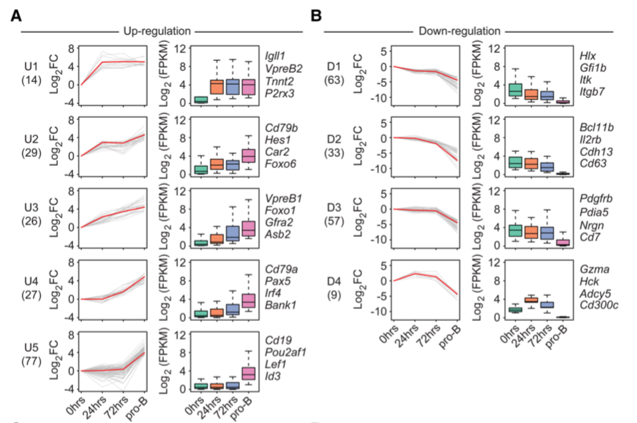

```{r setup, include=FALSE}
knitr::opts_chunk$set(echo = TRUE)
```

## 需求描述

时间序列数据，用STEM找出了profile，想用R画出文章里这样的图，右侧box plot要标出每两组之间的显著性。



出自<http://genesdev.cshlp.org/content/32/2/96>

Figure 3. Time-resolved analysis of transcript levels of genes containing EBF1-occupied sites within ±25 kb of transcription start sites before and after EBF1 induction (A,B). Up-regulated and down-regulated genes that change transcript levels >10-fold between 0 h and the pro-B stage are shown in A and B, respectively. Genes that are regulated by twofold to 10-fold are shown in Supplemental Figure S4, A and B. Individual transcript levels are shown in Supplemental Table S1 (>10-fold changes) and Supplemental Table S2 (twofold to 10-fold changes). Genes are organized into different clusters based on expression pattern using Short Time-series Expression Miner (STEM) (Ernst and Bar-Joseph 2006). Line plots (left panels) and box plots (right panels) are used to show fold changes (log2 scale) and absolute expression levels (log2 scale), respectively. Representative genes of each cluster are listed at the right. In each line plot, one representative gene is highlighted in red. (FC) Fold change; (FPKM) fragments per kilobase per million reads.

## 应用场景

多个时间点的时间序列数据，例如多个发育时期、处理后多个时间点取样，用STEM找到profile后，同时展示基因表达变化趋势以及基因表达量的分布。

STEM的用法和参数设置不是这里要讨论的内容，使用前请查看STEM软件自带的STEMmanual.pdf。

## 环境设置

使用国内镜像安装包

```r
options("repos"= c(CRAN="https://mirrors.tuna.tsinghua.edu.cn/CRAN/"))
options(BioC_mirror="http://mirrors.ustc.edu.cn/bioc/")
install.packages("Cairo")
```

加载包

```{r}
library(readr)
library(dplyr)
library(ggplot2)
library(stringr)
library(magrittr)
library(purrr)
library(tidyr)
library(tibble)
library(ggpubr)
library(RColorBrewer)
library(Cairo)
library(grid)

Sys.setenv(LANGUAGE = "en") #显示英文报错信息
options(stringsAsFactors = FALSE) #禁止chr转成factor
```

## 输入文件的预处理

### 输入文件的获得

需要4个文件作为输入，分别是STEM的2个输入文件和STEM生成的2个文件：

g27_1.txt，g27_2.txt，STEM的2个输入文件，为基因表达量矩阵，同一基因的多个点取median，**用来画右侧的box plot**。这里用STEM自带的示例文件，是时间序列表达数据，两次重复分别放在这两个文件中。自己的数据按照这个格式整理好。如果你有3次重复，按规律添加相应的代码即可。

下载STEM，进入stem文件夹，用命令行方式运行STEM：

```bash
java -mx1024M -jar stem.jar -b defaultsGuilleminSample.txt output
```

output文件夹下会产生以下两个文件，**用来画左侧的profile**：

defaultsGuilleminSample_profiletable.txt，profile table，**用来画红色线**。包含each profile ID, its corresponding expression pattern, the number of genes assigned, the number expected, and the p-value significance of the number of genes assigned.

defaultsGuilleminSample_genetable.txt，gene table，**用来画灰色线**。包含the table of genes, the spot(s) which the gene was from, the profile to which the gene and its expression values after transformation.

```{r}
# gene expression
exp_rep1 <- read.delim("g27_1.txt", check.names = F, row.names = 1,
                       colClasses=c("SPOT"="character"))
head(exp_rep1)
exp_rep2 <- read.delim("g27_2.txt", check.names = F, row.names = 1,
                       colClasses=c("SPOT"="character"))

# time point
tp <- colnames(exp_rep1)[2:ncol(exp_rep1)]

# profile
profiletable <- read.delim("defaultsGuilleminSample_profiletable.txt", check.names = F)
head(profiletable)

genetable <- read.delim("defaultsGuilleminSample_genetable.txt", check.names = F)
colnames(genetable)[4:ncol(genetable)] <- as.character(seq(1:length(tp) - 1))
head(genetable)
dim(genetable)
```

### 只保留进入profile的基因表达矩阵，用于画box plot

有些gene symbol对应多个SPOT，又有些SPOT没有gene symbol，defaultsGuilleminSample_genetable.txt把同一gene symbol对应的多个SPOT合并在一起，下面都围绕gene symbol来操作。

只有部分gene symbol进入STEM的profile，因此，精简表达矩阵，只保留进入profile的gene symbol，忽略没有gene symbol的SPOT。

```{r}
# Repeat data values will be averaged with the values from the original data file using the median.
# 合并2次重复，后面取均值画box plot
exp_all <- rbind(exp_rep1,exp_rep2)
colnames(exp_all)[2:ncol(exp_all)] <- as.character(seq(1:length(tp) - 1))

# 进入STEM profile的GeneSymbol
GeneSymbolp <- base::intersect(genetable$`Gene Symbol`, exp_all$`Gene Symbol`)
length(GeneSymbolp)

#只保留进入profile的Gene Symbol
exp_all <- exp_all[exp_all$`Gene Symbol` %in% GeneSymbolp,]
exp_all <- aggregate(.~`Gene Symbol`, exp_all, median) #有多个SPOT的基因，表达量取中值
dim(exp_all)
head(exp_all)

#向表达矩阵添加基因所在的profile
exp_all.pro <-  genetable %>% select(`Gene Symbol`, Profile) %>% 
  right_join(exp_all, by = "Gene Symbol") 
head(exp_all.pro)
dim(exp_all.pro)
```

### 为画左侧profile的红线做准备

每个profile红线的纵坐标被写进`profiletable`中一列里`Profile.Model`，所以需要分开：每个时间点单独一列。

```{r}
profiletable %<>% separate(col = `Profile Model`, 
                          into = as.character(seq(1:length(tp) - 1)), 
                          sep = ",", convert = TRUE) %>% 
  select(Profile = `Profile ID`, `Cluster (-1 non-significant)`, `# Genes Assigned`, `p-value`, as.character(seq(1:length(tp) - 1)))
head(profiletable)
```

### 分组并宽转长根据变量`Profile`分组，然后宽转长。

```{r}
# 定义一个函数，进行宽转长，并改变变量类型为数字
myfun <- function(df) {
  df %<>% gather(key = "x", value = "y", as.character(seq(1:length(tp) - 1))) %>% 
    mutate(x1 = as.numeric(x)) %>% select(-x) %>% rename(x = x1)
  return(df)
}

sig_num <- profiletable %>% select(Profile, `Cluster (-1 non-significant)`, `# Genes Assigned`, `p-value`)

profiletable %<>% select(- `Cluster (-1 non-significant)`, -`# Genes Assigned`, -`p-value`) %>% 
  group_by(Profile) %>% nest() %>% 
  mutate(., red = map(.$data, myfun)) %>% 
  select(Profile, red) %>% 
  left_join(sig_num, by = "Profile")

genetable %<>% 
  group_by(Profile) %>% nest() %>% 
  mutate(., grey = map(.$data, myfun)) %>% 
  select(Profile, grey)

exp_all.pro %<>% 
  group_by(Profile) %>% nest() %>% 
  mutate(., box = map(.$data, myfun)) %>% 
  select(Profile, box)
```

### `nest`合并

根据变量`Profile`，合并`genetable`, `profiletable`,`exp_all.pro`数据，后面画图所需要的数据就都存放在nest里了。

```{r}
nest <- genetable %>% left_join(profiletable, by = "Profile") %>% 
  left_join(exp_all.pro, by = "Profile") %>%
  arrange(`Cluster (-1 non-significant)`) #最后出图时按照cluster列从小到大排序

# 将`Profile`变量转变成因子，以便分面后一一对应。  
Profile <- nest$Profile %>% as.character()
Profile_2 <- as.factor(Profile)
levels(Profile_2) <- Profile
nest$Profile <- Profile_2 %>% sort() # 必须按因子水平排序
```

### 挑选profile

STEM定义significnat的profile会在Cluster (-1 non-significant)列标为不是-1的数。此处挑选这样的profile画出。

```{r}
nest_part <- nest[nest$`Cluster (-1 non-significant)` != (-1),]
nrow(nest_part)

#或者，你还可以自己指定画哪几个profile
#myprofile <- c("38", "43", "41", "42", "48")
#nest_part <- nest[nest$Profile %in% myprofile,]
```

## 开始画图

分别画左侧折线图和右侧box plot，写文字，最后用grid拼图。

### 左侧折线图

用分面来画多个profile

```{r}
plot_line <- 
  ggplot(data = nest_part %>% select(Profile, grey, `# Genes Assigned`) %>% unnest()) + 
  geom_line(aes(x = x, y = y, group = `Gene Symbol`), color = "grey") + 
  geom_line(data = nest_part %>% select(Profile, red, `# Genes Assigned`) %>% unnest(), 
            aes(x = x, y = y), color = "red") + 
  facet_grid(rows = vars(Profile)) + 
  scale_x_continuous(breaks = seq(1:length(tp) - 1), 
                     labels = tp) + # 坐标轴刻度标签

  theme(panel.background = element_rect(fill = "white", color = "black"),
        axis.title = element_blank(), 
        axis.text.x = element_text(angle = 45, hjust = .5, vjust = .5), # 调整坐标轴刻度标签角度及其位置
        strip.background = element_blank(), # 隐藏分面
        strip.text = element_blank(),
        axis.line = element_blank(),
        panel.border = element_rect(linetype = "solid", color = "black", fill = NA)) 

#plot_line
```

### 右侧箱线图

p值小于0.001标记为`**`, 大于0.001且小于0.05标记为`*`, 大于0.05不标记。 

```{r}
# 自定义差异性数据，如果你的时间点超过5个，就按排列组合规律继续添加
compaired <- list(
  c("1", "2"), c("1", "3"), c("1", "4"), c("1", "5"),
  c("2", "3"), c("2", "4"), c("2", "5"),
  c("3", "4"), c("3", "5"),
  c("4", "5")
)

nest_part_new <- nest_part
nest_part_new %<>% select(Profile, box) %>% unnest() 
x2 <- as.character(nest_part_new$x) %>% as.factor()
levels(x2) <- seq(1:length(tp) - 1)
nest_part_new$x2 <- x2

plot_box <- 
  nest_part_new %>% 
  ggplot(aes(x = x2, y = y, fill = x2, group = x2)) + 
  geom_boxplot(size = 0.25, 
               outlier.color = NA, #隐去箱线图上的异常点
               #或者用下面这行设置离群值点大小和颜色
               #outlier.size = 1, outlier.color = "grey", 
               show.legend = FALSE) + #不显示图例
  
  # 标注差异显著性
  # 默认wilcox.test，可添加method = 参数来修改统计检验方法
  # 这里有更多标注方式举例，https://rpkgs.datanovia.com/ggpubr/reference/stat_compare_means.html
  stat_compare_means(comparisons = compaired,
                     bracket.size = 0.25, size = 2,
                     label = "p.signif", hide.ns = TRUE, #不显著不显示
                     symnum.args = list(
                       cutpoints = c(0, 0.001, 0.05, 1), #根据自己的需要定cutoff
                       symbols = c("**", "*", " "))) + #根据自己的需要而定
  # 如果不想标注差异显著性，就不运行上面这段

  facet_grid(rows = vars(Profile)) + 
  scale_x_discrete(breaks = seq(1:length(tp) - 1), 
                     labels = tp) + # 坐标轴刻度标签
  scale_fill_brewer(palette = "Set2") + #box的配色
  theme(panel.background = element_rect(fill = "white", color = "black"),
        axis.title = element_blank(), 
        axis.text.x = element_text(angle = 45, hjust = .5, vjust = .5),
        axis.line.x.bottom = element_line(color = "black"),# 调整坐标轴刻度标签角度
        strip.background = element_blank(),
        strip.text = element_blank(),
        axis.line = element_blank(),
        panel.border = element_rect(linetype = "solid", color = "black", fill = NA)) 

#plot_box
```

### 用geom_text写y轴title

因为折线图和box plot都是用分面画的，要像例图那样每个都单独显示纵坐标，就需要另外添加。

因此，图中的文字，全部使用`geom_text()`手动添加。

```{r}
# profile的编号和每个profile内的基因数
plot_text_1 <- 
  nest_part %>% select(Profile, `# Genes Assigned`) %>% unnest() %>% 
  add_column(., x = rep(1, nrow(.))) %>% 
  add_column(., y = rep(1, nrow(.))) %>% 
  ggplot() + 
  geom_text(mapping = aes(x = x, y = x, label = paste0("U", Profile, "\n(", `# Genes Assigned`, ")"))) + 
  facet_grid(rows = vars(Profile)) + 
  theme(panel.background = element_blank(),
        axis.title = element_blank(), 
        axis.text = element_blank(),
        axis.ticks = element_blank(),
        strip.background = element_blank(),
        strip.text = element_blank()) 

#plot_text_1

# 折线图的y轴title
plot_text_2 <- nest_part %>% select(Profile, `# Genes Assigned`) %>% unnest() %>% 
  add_column(., x = rep(1, nrow(.))) %>% 
  add_column(., y = rep(1, nrow(.))) %>% 
  ggplot() + 
  geom_text(mapping = aes(x = x, y = x), 
            size = 3, 
            label = expression('Log'[2]*'FC'), angle = 90) + 
  facet_grid(rows = vars(Profile)) + 
  theme(panel.background = element_blank(),
        axis.title = element_blank(), 
        axis.text = element_blank(),
        axis.ticks = element_blank(),
        strip.background = element_blank(),
        strip.text = element_blank()) 

#plot_text_2

# box plot的y轴title
plot_text_3 <- nest_part %>% select(Profile, `# Genes Assigned`) %>% unnest() %>% 
  add_column(., x = rep(1, nrow(.))) %>% 
  add_column(., y = rep(1, nrow(.))) %>% 
  ggplot() + 
  geom_text(mapping = aes(x = x, y = x), 
            size = 3,
            label = expression('Log'[2]*'(signal)'), angle = 90) + 
  facet_grid(rows = vars(Profile)) + 
  theme(panel.background = element_blank(),
        axis.title = element_blank(), 
        axis.text = element_blank(),
        axis.ticks = element_blank(),
        strip.background = element_blank(),
        strip.text = element_blank()) 

#plot_text_3
```

### Representative基因名

Representative genes of each cluster are listed at the right.

每一张图对应几十个基因，甚至上百个基因，而图中只显示了4个，文献中并没有说明是如何筛选出这4个基因的。我们这里使用自定义函数筛选，数据框输入。

或者不运行这部分，最后出图后可自行添加基因名。

**如果读者有其它筛选方式，只需要修改自定义函数就行了**。 

```{r}
# 自定义基因筛选函数,这里随机取4个
myfilter <- function(df) {
  Gene_four <- df$`Gene Symbol` %>% unique() %>%
    sample(size = 4, replace = TRUE) %>% 
    paste0(collapse = "\n") # 必须拼接为长度为1的字符串
  return(Gene_four)
}

# 调用函数对每个Profile筛选基因
Gene_part <- nest_part %>% select(Profile, grey) %>% 
  mutate(., Gene_four = map(.$grey, myfilter)) %>% 
  select(Profile, Gene_four) %>% unnest() 

plot_text_4 <- Gene_part %>% 
  add_column(., x = rep(1, nrow(.))) %>% 
  add_column(., y = rep(1, nrow(.))) %>% 
  ggplot() + 
  geom_text(mapping = aes(x = x, y = x, label = Gene_four), 
            size = 3) + 
  facet_grid(rows = vars(Profile)) + 
  theme(panel.background = element_blank(),
        axis.title = element_blank(), 
        axis.text = element_blank(),
        axis.ticks = element_blank(),
        strip.background = element_blank(),
        strip.text = element_blank()) 

#plot_text_4
```

### 拼图并输出

这里使用`grid`包拼图。

```{r, fig.width=6, fig.height=14}
CairoPDF(file = "STEMbox.pdf", width = 6, height = 14)

grid.newpage() # 新建画布
layout_1 <- grid.layout(nrow = 1, ncol = 6, 
                        widths = c(0.3, 0.2, 1, 0.2, 1, 0.5)) # 宽度比例，
## 如果想自行设置长宽比，可以增加ncol，同时在widths后面增加一个数字，这个数字不填充画图对象，这样就能调整长宽比例了。  
pushViewport(viewport(layout = layout_1)) # 推出视窗
print(plot_text_1, vp = viewport(layout.pos.col = 1))
print(plot_text_2, vp = viewport(layout.pos.col = 2))
print(plot_line, vp = viewport(layout.pos.col = 3))
print(plot_text_3, vp = viewport(layout.pos.col = 4))
print(plot_box, vp = viewport(layout.pos.col = 5))
print(plot_text_4, vp = viewport(layout.pos.col = 6)) #不想在右侧写基因名就不运行这行

dev.off()
```


## 后期处理

输出的pdf文件是矢量图，可以用Illustrator等软件打开、编辑、导出其他图片格式。

**参考资料：**   

* [ggsignif差异性分析](https://mp.weixin.qq.com/s?__biz=MzI3Mzc1MzczMA==&mid=2247484318&idx=1&sn=aeeb47d5f0cc6ce0971032f4709393ef&chksm=eb1f3073dc68b9651aa3fe1fed06db66ade6231c5f9790868ffcf680e76f67e329e04f823da3&scene=21)   
* [ggpubr差异性分析](https://rpkgs.datanovia.com/ggpubr/)   
* [ggboxplot函数](https://rpkgs.datanovia.com/ggpubr/reference/ggboxplot.html)   
* [Add P-values and Significance Levels to ggplots](http://www.sthda.com/english/articles/24-ggpubr-publication-ready-plots/76-add-p-values-and-significance-levels-to-ggplots/)   
* [R语言可视化学习笔记之添加p-value和显著性标记](https://zhuanlan.zhihu.com/p/27491381)

```{r}
sessionInfo()
```