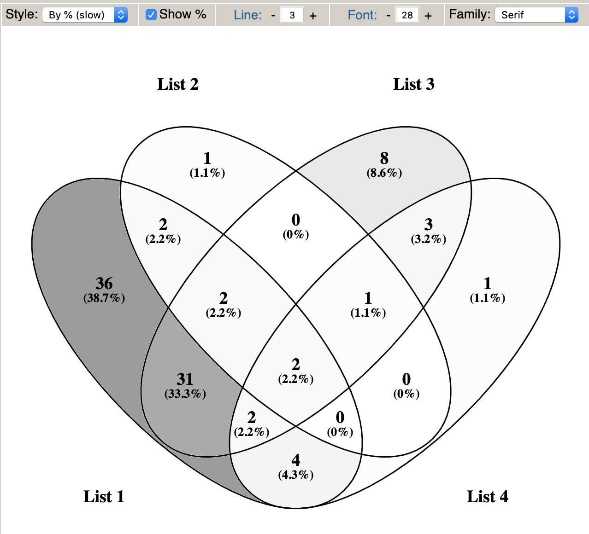

```{r setup, include=FALSE}
knitr::opts_chunk$set(echo = TRUE)
```

## 需求描述

venny<http://bioinfogp.cnb.csic.es/tools/venny/>，新出来个选项，颜色填充by%，然而只能填充灰色，我想要彩色，而且venny只能保存成png，我想要pdf矢量图。没有现成的R包能直接实现这样的按百分比填充颜色的效果。输入四个基因列表，画出venn图。



出自<http://bioinfogp.cnb.csic.es/tools/venny/>

## 应用场景

展示4组元素（例如差异表达基因）数量重叠，数量多颜色深，数量少颜色浅，一目了然。

## 环境设置

使用国内镜像安装包

```{r}
options("repos"= c(CRAN="https://mirrors.tuna.tsinghua.edu.cn/CRAN/"))
options(BioC_mirror="http://mirrors.ustc.edu.cn/bioc/")
```

加载包

```{r}
library(VennDiagram)
library(colorfulVennPlot)
library(ggplot2)
library(dplyr)
library(magrittr)
library(readr)
library(purrr)
library(RColorBrewer)
library(grDevices)
library(Cairo)
library(stringr)
library(tibble)
library(tidyr)
Sys.setenv(LANGUAGE = "en") #显示英文报错信息
options(stringsAsFactors = FALSE) #禁止chr转成factor
```

## 输入文件

四个基因列表文件，每个文件中是这组内的所有基因名。

```{r}
filenames <- paste0("easy_input_", 1:4, ".txt")
data_ls <- filenames %>% map(., ~read_table(.x, col_names = FALSE)) %>% map(., ~.x$X1)
names(data_ls) <- paste0("G", 1:length(data_ls)) # 重命名
str(data_ls)

# venn.diagram这个包画韦恩图最成熟，直接就能画venn图，用它来检验一下数据对不对 
venn.diagram(x = data_ls, filename = "venn_test.png")
```

下面将用`colorfulVennPlot`包画图，这个包画韦恩图最全，当然使用也是最复杂的。

**优点：**可以自己定义每个区域的颜色，这刚好能够满足我们按比例填充颜色的需求。

**缺点：**每个区域的数字也要自己来提供，就需要先计算。

包里自带的画四组venn图的函数长这样：

```
plotVenn4d(x, labels = c('A','B','C','D'),
  Colors = c('red', 'yellow', 'green', 'pink','darkgreen','blue','lightblue','tan', 
  'yellowgreen','orange','purple','white','grey','plum','brown'),
  Title = NULL, shrink = 1, rot=45)
```

**参数解释：**    

* `x`, 一个带有`names`属性的数字向量，其长度与韦恩图中**子区域**数量一致,   
  通常用数字代表**子区域**中元素的数量。    
  其名称属性为`0`与`1`的组合的字符串，`1`表示在韦恩图中某个类别为**肯定**，`0`表示否定。  
  如`"1010"`表示在左起第1个椭圆内，且在左起第3个椭圆内，且不在左起第2个或第4个椭圆内。  
* `labels`, 表示指定椭圆的标签，从左到右排列，字符串向量指定。  
* `Colors`, 表示指定**子区域**的fill颜色，顺序与`x`一一对应。  
* `rot`, 表示指定韦恩图的旋转角度。  
* `Title`, 表示指定标题。  

下面将根据`plotVenn4d`的特点构造数据：

* 计算**子区域**编号。  
* 根据**子区域**编号计算各个**子区域**中元素的数量。  
* 计算**子区域**的数量占所有区域数量之和的**百分比**。    
* 根据**百分比**构造颜色向量。  

## 计算子区域元素数量、百分比

```{r}
# 子区域数量
number_area <- 2^length(data_ls) - 1 # 

# 子区域编号
## 自定义一个函数，将整数转换成二进制字符串
intToBin <- function(x){
  if (x == 1)
    1
  else if (x == 0)
    NULL
  else {
   mod <- x %% 2
   c(intToBin((x-mod) %/% 2), mod)
  }
}

x_area <- seq(number_area) %>% map(., ~intToBin(.x)) %>%  # 转换成二进制字符串
  map_chr(., ~paste0(.x, collapse = "")) %>% 
  map_chr(., ~str_pad(.x, width = length(data_ls), side = "left", pad = "0"))
```

**计算子区域中元素的数量、百分比：**    

```{r}
# 取data_ls中的向量取并集
G_union <- data_ls$G1 %>% union(data_ls$G2) %>% 
  union(data_ls$G3) %>% union(data_ls$G4)

# 自定义一个函数，计算子区域中元素的数量
area_calculate <- function(data_ls, character_area){
   character_num <- 1:4 %>% map_chr(., ~substr(character_area, .x, .x)) %>% 
     as.integer() %>% as.logical()
   
   element_alone <- G_union
   for (i in 1:4) {
     element_alone <- 
       if (character_num[i]) {
         intersect(element_alone, data_ls[[i]])
       } else {
         setdiff(element_alone, data_ls[[i]])
       }
   }
   return(element_alone)
}

# 调用自定义的函数，求各个子区域的元素
element_ls <- map(x_area, ~area_calculate(data_ls = data_ls, character_area = .x))

# 计算各个子区域中元素的数量：
quantity_area <- map_int(element_ls, length)

# 计算各个子区域中元素数量的百分比
percent_area <- (quantity_area / sum(quantity_area)) %>% round(3) # 四舍五入保留3位小数
percent_area <- (percent_area * 100) %>% paste0("%")
```

## 计算每个区域的颜色

使用`RColorBrewer`中的色板构造颜色向量。  

```{r}
# 色板长度
length_pallete <- max(quantity_area) - min(quantity_area) + 1
color_area <- colorRampPalette(brewer.pal(n = 7, name = "YlGn"))(length_pallete) #其中YlGn可以换成其他颜色组合，例如Blues BuGn BuPu GnBu Greens Greys Oranges OrRd PuBu PuBuGn PuRd Purples RdPu Reds YlGn YlGnBu YlOrBr YlOrRd
color_tb <- tibble(quantity = seq(min(quantity_area), max(quantity_area), by = 1),
                   color = color_area) 

nest1 <- tibble(quantity = quantity_area, percent = percent_area, area = x_area) %>% 
  group_by(quantity) %>% nest() %>% 
  left_join(color_tb, by = "quantity") %>% 
  arrange(quantity) %>% 
  unnest()
```

## 开始画图

```{r}
# Venn图中显示数量
regions <- nest1$quantity
names(regions) <- nest1$area

CairoPDF(file = "venn_num.pdf", width = 8, height = 6)
plot.new()
plotVenn4d(regions, Colors = nest1$color, Title = "", 
           labels = paste0("G", 1:4)) #从左至右与输入文件顺序对应
dev.off() # 关闭绘图以保存

# Venn图中显示百分比图
regions <- nest1$percent
names(regions) <- nest1$area

CairoPDF(file = "venn_percent.pdf", width = 8, height = 6)
plot.new()
plotVenn4d(regions, Colors = nest1$color, Title = "", 
           labels = paste0("G", 1:4)) #从左至右与输入文件顺序对应
dev.off() # 关闭绘图以保存
```

## 后期处理

输出的pdf是矢量图，可以用Illustrator等软件打开，调整字号等。

---

**参考来源：**    

* [一些漂亮的venn图](https://www.cnblogs.com/xianghang123/archive/2013/03/25/2980623.html)   
* [如何使用R来绘制韦恩图（Venn Diagram）](http://blog.sciencenet.cn/home.php?mod=space&uid=2985160&do=blog&id=957210)  
* [用 R 的 venn 包画五组数据的文氏图](https://nachtzug.xyz/2019/01/19/venn-diagram-with-R-venn-package/)  
* [R语言画维恩图--VennDiagram](https://www.jianshu.com/p/a653ea616407)   
* [R语言基础绘图——韦恩图](https://shengxin.ren/article/130)   
* [详解R语言画韦恩图](https://blog.csdn.net/u011808596/article/details/80974250)   
* [colorfulVennPlot](https://github.com/BITS-VIB/venn-tools)   
* [colorfulVennPlot源代码](https://github.com/cran/colorfulVennPlot/tree/master/R)   
* [数字转二进制](https://stackoverflow.com/questions/12088080/how-to-convert-integer-number-into-binary-vector)   

```{r}
sessionInfo()
```